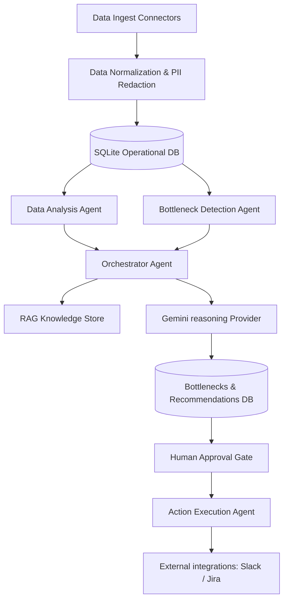

# Architecture Overview — OBottleAI

This document details the software architecture of the OBottleAI system as outlined in the system architecture design.

## 1. Component Topology

## 2. Agent Orchestration Layer
- **Orchestrator**: Acts as the centralized pipeline controller. Manages state synchronization, calls analytical modules, queries the knowledge base, invokes Gemini, and logs operations.
- **Data Analysis**: Computes operational throughput and workload allocations.
- **Bottleneck Detection**: Employs static heuristic rules to highlight anomalies.
- **Root Cause & Recommendations**: Powered by `gemini-1.5-pro` using structured JSON output prompts.
- **RAG Engine**: Employs word-overlap matching to retrieve grounding documentation (e.g., SLA guidelines, escalation policies).

## 3. Database Layer
- **SQLite**: Local relational database mapping all operational records, audit logs, recommendations, and execution states.
- **SQLAlchemy ORM**: Configures tables and relationships with automatic database creations on startup.
